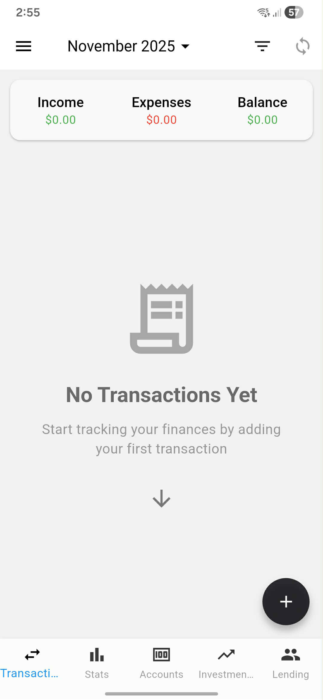
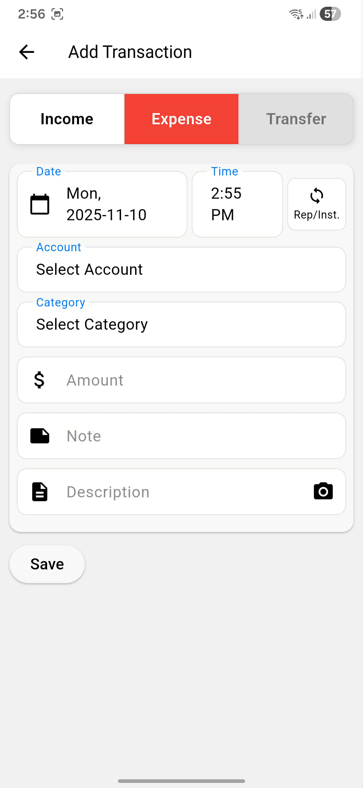
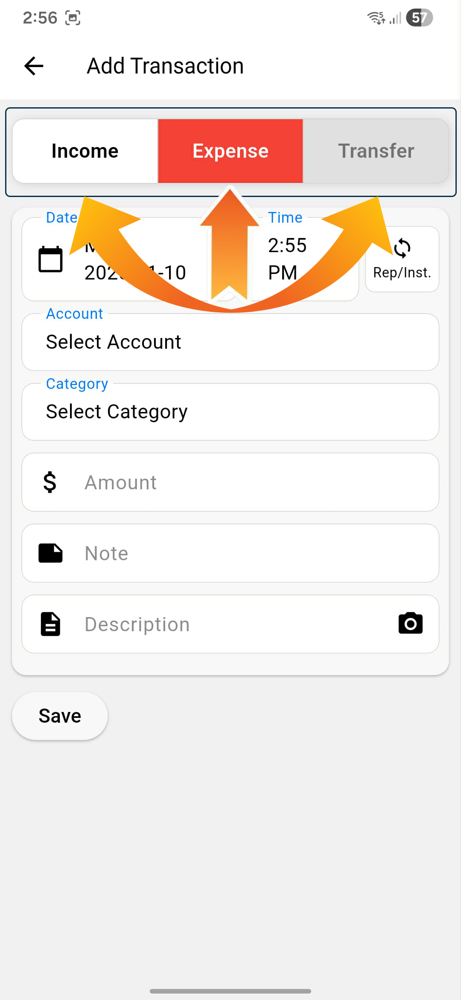
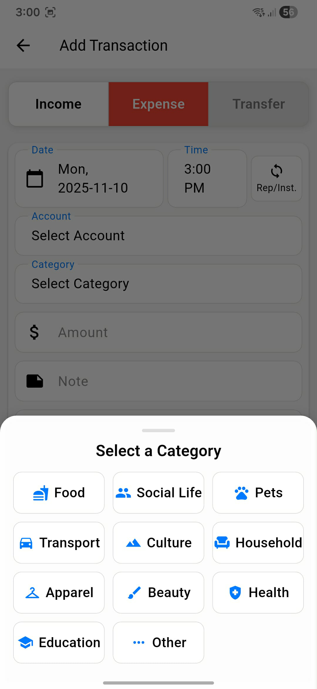
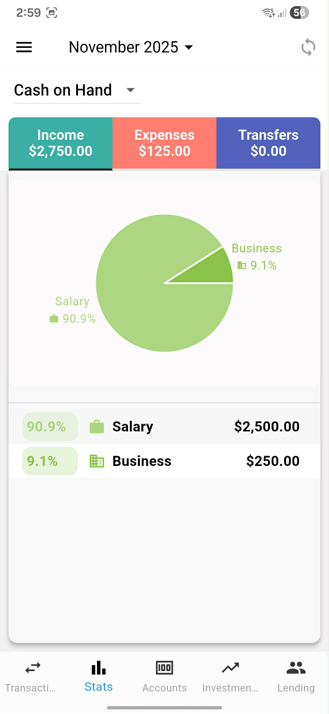

<!DOCTYPE html>
<html lang="en">
<head>
    <meta charset="UTF-8">
    <meta name="viewport" content="width=device-width, initial-scale=1.0">
    <link rel="stylesheet" href="assets/css/style.css">
</head>
<body>

<!-- Navigation Bar -->
<nav class="nav-bar">
    

        <a href="https://aethersolutionsph.github.io/finance-manager-privacy/" class="nav-brand">Finance Manager</a>
        

            <a href="https://aethersolutionsph.github.io/finance-manager-privacy/">Privacy Policy</a>
            <a href="https://aethersolutionsph.github.io/finance-manager-user-manual/" class="active">User Manual</a>
            <a href="https://aethersolutionsph.github.io/finance-manager-delete-account/">Delete Account</a>
            <a href="mailto:aether.solutionsph@gmail.com">Support</a>
        

    

</nav>

# Finance Manager - User Manual

Version 1.0.0
Complete Money Management Made Simple

---

## Table of Contents

1. [Getting Started](#getting-started)
2. [Home Dashboard](#home-dashboard)
3. [Managing Transactions](#managing-transactions)
4. [Accounts Management](#accounts-management)
5. [Statistics & Reports](#statistics--reports)
6. [Investment Tracking](#investment-tracking-premium)
7. [Lending & Borrowing](#lending--borrowing-premium)
8. [Tax Management](#tax-management)
9. [Settings & Preferences](#settings--preferences)
10. [Cloud Sync & Backup](#cloud-sync--backup)
11. [Subscription Plans](#subscription-plans)
12. [Troubleshooting](#troubleshooting)

---

## Getting Started

### First Time Setup

1. **Download & Install**
   - Download Finance Manager from Google Play Store
   - Install and open the app

2. **Sign In (Optional)**
   - Tap **Sign in with Google** on the welcome screen
   - Select your Google account
   - Grant necessary permissions
   - **Benefits**: Cloud sync, backup, and cross-device access

3. **Set Your Currency**
   - Go to **Settings** → **Currency**
   - Select your preferred currency from 150+ world currencies
   - All amounts will display in this currency

4. **Create Your First Account**
   - Tap **Accounts** tab at the bottom
   - Tap the **+** button
   - Enter account name (e.g., "Cash", "Bank Account")
   - Set initial balance
   - Choose account type and color
   - Tap **Save**

### Navigation

The app has **4 main tabs** at the bottom:

- **🏠 Home**: Dashboard with overview and quick stats
- **📊 Transactions**: View and manage all transactions
- **📈 Stats**: Detailed charts and analytics
- **⚙️ Settings**: App preferences and account management

<!-- Screenshot: Welcome screen with navigation tabs -->
<!--  -->
<!-- *Main navigation showing the 4 tabs at the bottom* -->

---

## Home Dashboard

<!-- Screenshot: Full home dashboard view -->
<!--  -->
<!-- *Home screen showing accounts, transactions, and quick action button* -->

### What You See

**Account Summary Card**
- Total balance across all accounts
- Quick view of all your accounts
- Tap to see detailed breakdown

**Recent Transactions**
- Last 10 transactions displayed
- Shows date, category, amount
- Swipe left to edit or delete
- Tap to view full details

**Quick Action Button (+)**
- Floating button in the bottom right
- Tap to add new transaction instantly

**Navigation Menu (☰)**
- Access to all app features
- Premium features
- Investment tracking
- Lending management
- Tax settings

### Quick Actions

**Add Transaction**
1. Tap the **+** button (bottom right)
2. Fill in transaction details
3. Tap **Save**

**View Account Details**
- Tap any account card
- See transaction history for that account
- View account balance over time

---

## Managing Transactions

### Types of Transactions

1. **Expense** - Money spent
2. **Income** - Money received
3. **Transfer** - Move money between accounts

### Adding a Transaction

<!-- Screenshot: Add transaction form -->
<!--  -->
<!-- *New transaction form showing all input fields* -->

1. **Tap the + Button**
   - Located at bottom right of Home screen

2. **Select Transaction Type**
   - Choose: Expense, Income, or Transfer

<!-- Screenshot: Transaction type selection -->
<!--  -->
<!-- *Selecting between Expense, Income, and Transfer* -->

3. **Fill in Details**
   - **Amount**: Use built-in calculator or type directly
   - **Category**: Select from pre-defined categories
   - **Account**: Choose which account to deduct/credit
   - **Date**: Pick transaction date (defaults to today)
   - **Note**: Add description (optional)
   - **Receipt**: Attach photo (optional)

4. **Advanced Options**
   - **Recurring**: Set up repeating transactions
   - **Tax**: Link to tax categories (for tax reporting)

5. **Tap Save**

### Transaction Categories

<!-- Screenshot: Category selection modal -->
<!--  -->
<!-- *Category picker showing all available categories* -->

**Expense Categories:**
- 🛒 Shopping
- 🍕 Food & Dining
- 🚗 Transportation
- 🏠 Bills & Utilities
- 🎬 Entertainment
- 🏥 Health & Medical
- 📚 Education
- 💰 Savings
- And more...

**Income Categories:**
- 💼 Salary
- 💵 Business
- 🎁 Gift
- 💰 Investment Returns
- And more...

### Editing Transactions

**Method 1: From Transaction List**
1. Go to **Transactions** tab
2. Find the transaction
3. Swipe left on the transaction
4. Tap **Edit** icon
5. Make changes
6. Tap **Save**

**Method 2: From Transaction Details**
1. Tap any transaction to view details
2. Tap **Edit** button
3. Make changes
4. Tap **Save**

### Deleting Transactions

1. Swipe left on any transaction
2. Tap **Delete** icon
3. Confirm deletion

### Attaching Receipts

1. When adding/editing a transaction
2. Tap **Add Receipt** or camera icon
3. Choose:
   - Take photo with camera
   - Select from gallery
4. Photo will be saved with transaction
5. Tap receipt to view full screen

### Recurring Transactions

Set up transactions that repeat automatically:

1. **Create Transaction**
2. **Enable "Recurring"** toggle
3. **Select Frequency**:
   - Daily
   - Weekly
   - Monthly
   - Yearly
   - Custom interval
4. **Set End Date** (optional)
5. **Tap Save**

**Managing Recurring Transactions:**
- Go to **Settings** → **Recurring Transactions**
- View all active recurring transactions
- Edit or delete recurring schedules
- Transactions auto-create on schedule

---

## Accounts Management

### Account Types

Finance Manager supports multiple account types:
- 💳 **Bank Accounts**
- 💵 **Cash**
- 💰 **Savings**
- 🏦 **Credit Card**
- 📱 **Digital Wallet**
- 🪙 **Cryptocurrency Wallet** (Premium)

### Creating an Account

1. **Tap Accounts Tab**
2. **Tap + Button**
3. **Enter Details**:
   - Account Name (e.g., "Chase Bank", "Cash Wallet")
   - Account Type
   - Initial Balance
   - Account Color (for visual distinction)
   - Currency (if different from default)
4. **Tap Save**

### Viewing Account Details

1. Tap any account card
2. View:
   - Current balance
   - All transactions for this account
   - Balance trend over time
   - Monthly spending breakdown

### Editing Accounts

1. Go to **Accounts** tab
2. Tap the account you want to edit
3. Tap **Edit** icon (top right)
4. Update details
5. Tap **Save**

### Deleting Accounts

1. Open account details
2. Tap **Edit** icon
3. Tap **Delete Account**
4. **Warning**: All transactions for this account will be removed
5. Confirm deletion

### Transfer Between Accounts

1. **Tap + Button** to add transaction
2. **Select "Transfer" Type**
3. **Choose**:
   - **From Account**: Source account
   - **To Account**: Destination account
   - **Amount**: How much to transfer
   - **Date**: When transfer occurred
4. **Tap Save**

**Result**: Money is deducted from one account and added to another

### Cryptocurrency Wallets (Premium Feature)

Track your crypto holdings:

1. **Go to Menu** → **Crypto Wallets**
2. **Add Wallet**
3. **Enter**:
   - Wallet name
   - Cryptocurrency type (Bitcoin, Ethereum, etc.)
   - Amount
   - Purchase price (optional for tracking gains/losses)
4. **View Portfolio**:
   - Total crypto value
   - Individual coin balances
   - Performance tracking

---

## Statistics & Reports

### Accessing Stats

Tap the **📈 Stats** tab at bottom navigation

<!-- Screenshot: Stats screen with charts -->
<!--  -->
<!-- *Statistics screen showing various charts and insights* -->

### Available Charts

**1. Monthly Overview**
- Total income vs expenses
- Net savings/spending
- Compare current vs previous months

**2. Category Breakdown**
- Pie chart showing spending by category
- Percentage of total for each category
- Top spending categories

**3. Trend Analysis**
- Line graph of spending over time
- Identify spending patterns
- Seasonal trends

**4. Account Balances**
- Historical balance for each account
- Net worth tracking
- Asset allocation

### Filtering Data

**By Date Range:**
- Current Month (default)
- Last Month
- Last 3 Months
- Last 6 Months
- Last Year
- Custom Range

**By Category:**
- View stats for specific categories
- Compare categories side-by-side

**By Account:**
- Filter by specific account
- Compare account performance

### Exporting Reports

1. **Go to Stats Screen**
2. **Tap Export Icon**
3. **Choose Format**:
   - PDF Report
   - Excel Spreadsheet
   - CSV File
4. **Select Date Range**
5. **Tap Export**
6. Share via email, cloud storage, or save locally

---

## Investment Tracking (Premium)

**🔒 Requires Premium Subscription**

Track stocks, bonds, mutual funds, and other investments.

### Adding an Investment

1. **Open Menu** → **Investments**
2. **Tap + Button**
3. **Enter Details**:
   - Investment Name (e.g., "Apple Stock")
   - Investment Type (Stock, Bond, Mutual Fund, Real Estate)
   - Purchase Date
   - Purchase Price
   - Quantity/Units
   - Current Value (updates manually or automatically)
4. **Tap Save**

### Investment Dashboard

**Portfolio Overview:**
- Total investment value
- Total gains/losses
- Percentage returns
- Best/worst performers

**Individual Investment Details:**
- Purchase price vs current value
- Gain/Loss amount and percentage
- Time held
- Transaction history

### Updating Investment Values

**Manual Update:**
1. Open investment details
2. Tap **Update Value**
3. Enter current market price
4. Tap **Save**

**Transaction History:**
- Track buy/sell transactions
- Record dividends received
- Calculate cost basis

### Investment Reports

- Performance over time
- Asset allocation breakdown
- Realized vs unrealized gains
- Tax reporting data

---

## Lending & Borrowing (Premium)

**🔒 Requires Premium Subscription**

Keep track of money you've lent to others or borrowed.

### Recording a Loan

1. **Open Menu** → **Lending**
2. **Tap + Button**
3. **Select Type**:
   - **Lent**: Money you gave to someone
   - **Borrowed**: Money you owe someone
4. **Enter Details**:
   - Person's Name
   - Amount
   - Date
   - Due Date (optional)
   - Interest Rate (optional)
   - Notes
5. **Tap Save**

### Loan Dashboard

**Active Loans:**
- Total lent out
- Total borrowed
- Net lending position
- Overdue loans highlighted

**Loan Details:**
- Amount and date
- Payments made
- Balance remaining
- Contact information

### Recording Payments

1. **Open loan details**
2. **Tap "Record Payment"**
3. **Enter**:
   - Payment amount
   - Date
   - Payment method
4. **Tap Save**

**Result**: Balance automatically updates

### Reminders

- Set reminders for due dates
- Get notifications for overdue loans
- Send payment reminders

---

## Tax Management

Track tax-deductible expenses and prepare for tax season.

### Setting Up Tax Categories

1. **Go to Settings** → **Tax Settings**
2. **Create Tax Categories**:
   - Business Expenses
   - Medical Expenses
   - Charitable Donations
   - Education
   - Home Office
   - Travel
3. **Tap Save**

### Linking Transactions to Tax Categories

**When Adding Transaction:**
1. Fill in transaction details
2. Tap **Tax** field
3. Select applicable tax category
4. Save transaction

**For Existing Transaction:**
1. Edit the transaction
2. Add tax category
3. Save changes

### Tax Reports

1. **Go to Tax Settings**
2. **Tap "Generate Tax Report"**
3. **Select**:
   - Tax year
   - Tax categories to include
4. **Export as PDF or Excel**

**Report Includes:**
- Total by tax category
- Transaction details
- Receipt attachments
- Summary for tax filing

### Tax Deduction Tracking

- See total deductions by category
- Year-over-year comparison
- Receipt organization
- Audit-ready documentation

---

## Settings & Preferences

### Accessing Settings

Tap **⚙️ Settings** tab at bottom navigation

### Available Settings

**Account & Profile**
- Google Sign-In / Sign-Out
- View account email
- Subscription status
- Restore purchases

**Currency**
- Change display currency
- 150+ currencies supported
- Affects all monetary displays

**Appearance**
- Light Mode
- Dark Mode
- System Default (follows device)

**Notifications**
- Daily reminders to log expenses
- Recurring transaction alerts
- Due date reminders (for lending)
- Set reminder time

**Recurring Transactions**
- View all recurring transactions
- Edit schedules
- Delete recurring items

**Tax Settings**
- Manage tax categories
- Generate tax reports
- Export tax data

**Data Management**
- Backup data
- Restore from backup
- Export all data
- Reset all data (⚠️ irreversible)

**Premium**
- View subscription details
- Manage subscriptions
- Upgrade/downgrade plans
- Restore purchases

**About**
- App version
- Privacy policy
- Terms of service
- Contact support

### Changing Currency

1. **Go to Settings** → **Currency**
2. **Select Currency** from dropdown
3. Format: `USD - United States Dollar ($)`
4. Currency updates immediately

### Setting Daily Reminders

1. **Go to Settings** → **Notifications**
2. **Enable Daily Reminder**
3. **Set Time** (e.g., 8:00 PM)
4. Receive daily prompt to log expenses

### Backup & Restore

**Manual Backup:**
1. **Go to Settings** → **Backup Data**
2. **Choose Backup Location**:
   - Google Drive (if signed in)
   - Local device storage
   - Export as file
3. Backup includes all transactions, accounts, categories

**Restore from Backup:**
1. **Go to Settings** → **Restore Data**
2. **Select Backup File**
3. Confirm restoration
4. ⚠️ Warning: Current data will be replaced

### Reset All Data

⚠️ **Use with extreme caution!**

1. **Go to Settings** → **Reset Data**
2. **Tap "Reset All Data"**
3. **Confirm action**
4. All transactions, accounts, and data will be **permanently deleted**
5. Cannot be undone unless you have a backup

---

## Cloud Sync & Backup

**🔒 Requires Budget or Premium Subscription**

### Benefits of Cloud Sync

- ✅ Automatic backup to cloud
- ✅ Sync across multiple devices
- ✅ Data recovery if device is lost
- ✅ Seamless Google Account integration
- ✅ Real-time synchronization

### How It Works

**Automatic Sync:**
- When signed in with Google Account
- Data syncs automatically to Firebase
- Happens in background when internet available
- No manual action required

**What Gets Synced:**
- All transactions
- All accounts
- Recurring transactions
- Investment data (Premium)
- Lending records (Premium)
- Tax categories
- App preferences
- Subscription status

### Using Multiple Devices

1. **Sign in** with same Google Account on all devices
2. Data **automatically syncs** between devices
3. Changes on one device appear on others
4. Real-time or next app launch

### Manual Sync

1. **Pull down** on Home screen to refresh
2. Or go to **Settings** → **Sync Now**

### Offline Mode

- App works fully offline
- Changes saved locally
- Syncs automatically when internet returns
- No data loss

### Google Drive Backup

**Enable Drive Backup:**
1. **Sign in** with Google
2. **Go to Settings** → **Cloud Sync**
3. **Enable Google Drive Backup**
4. Automatic daily backups to your Drive

**Restore from Drive:**
1. Reinstall app on new device
2. Sign in with Google Account
3. App detects cloud backup
4. Choose to restore
5. All data restored

---

## Subscription Plans

Finance Manager offers **3 subscription tiers**:

### Free Plan

**Included Features:**
- ✅ Unlimited transactions
- ✅ Multiple accounts
- ✅ Basic categories
- ✅ Transaction history
- ✅ Basic statistics
- ✅ Tax tracking
- ✅ Recurring transactions
- ❌ Cloud sync
- ❌ Investment tracking
- ❌ Lending management
- ⚠️ Contains ads

### Budget Plan

**Monthly: $1.00/month**
**Yearly: $11.00/year** (Save 8%)

**Everything in Free, plus:**
- ✅ **Ad-free experience**
- ✅ **Cloud sync & backup**
- ✅ Multi-device access
- ✅ Google Drive integration
- ✅ Priority support
- ❌ Investment tracking
- ❌ Lending management

**Best for:** Users who want ad-free experience and cloud backup

### Premium Plan

**Monthly: $2.50/month**
**Yearly: $27.00/year** (Save 10%)

**Everything in Budget, plus:**
- ✅ **Investment tracking**
  - Stocks, bonds, mutual funds
  - Portfolio management
  - Gains/loss tracking
  - Performance analytics
- ✅ **Lending & borrowing management**
  - Track loans given and received
  - Payment tracking
  - Reminders for due dates
- ✅ **Cryptocurrency wallets**
- ✅ **Advanced reports**
- ✅ **Export to Excel/PDF**
- ✅ **Priority customer support**

**Best for:** Power users and investors

### Subscribing

1. **Go to Settings** → **Premium**
2. **View Plans**
3. **Select Your Plan**:
   - Budget Monthly
   - Budget Yearly (save 8%)
   - Premium Monthly
   - Premium Yearly (save 10%)
4. **Tap Subscribe**
5. Complete Google Play payment
6. Features unlock immediately

### Managing Subscription

**View Status:**
- Go to **Settings** → **Premium**
- See current plan and expiry date

**Cancel Subscription:**
1. Open **Google Play Store**
2. Go to **Menu** → **Subscriptions**
3. Find **Finance Manager**
4. Tap **Cancel**
5. Access continues until period ends

**Upgrade/Downgrade:**
1. Go to **Settings** → **Premium**
2. Select new plan
3. Change takes effect immediately
4. Prorated billing applied

**Restore Purchases:**
- Reinstalled app?
- Go to **Settings** → **Premium** → **Restore Purchases**
- Subscription status restored

---

## Troubleshooting

### Common Issues

#### **Google Sign-In Not Working**

**Problem:** Can't sign in with Google Account

**Solutions:**
1. Check internet connection
2. Update app to latest version
3. Update Google Play Services
4. Clear app cache:
   - Go to device **Settings** → **Apps** → **Finance Manager**
   - Tap **Clear Cache** (not Clear Data)
5. Try signing out and back in

#### **Transactions Not Syncing**

**Problem:** Data not syncing across devices

**Solutions:**
1. Verify signed in with same Google Account on all devices
2. Check internet connection
3. Pull down on Home screen to force refresh
4. Go to **Settings** → **Sync Now**
5. Check subscription status (Budget or Premium required)

#### **Subscription Not Activating**

**Problem:** Paid for subscription but features locked

**Solutions:**
1. Go to **Settings** → **Premium** → **Restore Purchases**
2. Check Google Play purchase:
   - Open Play Store → Menu → Subscriptions
   - Verify Finance Manager shows as active
3. Wait 5-10 minutes for server sync
4. Restart app
5. Contact support with purchase receipt

#### **App Crashes or Freezes**

**Solutions:**
1. **Force Close App**:
   - Device Settings → Apps → Finance Manager → Force Stop
2. **Clear Cache**:
   - Device Settings → Apps → Finance Manager → Clear Cache
3. **Update App**:
   - Open Play Store and check for updates
4. **Reinstall App**:
   - ⚠️ First backup data if not using cloud sync
   - Uninstall and reinstall from Play Store

#### **Lost Data After Reinstall**

**Prevention:**
- Always sign in with Google for automatic backup
- Or manually backup before uninstalling

**Recovery:**
1. Sign in with Google Account
2. Go to **Settings** → **Restore from Cloud**
3. Or restore from manual backup file

#### **Categories Missing or Wrong**

**Problem:** Categories appear incorrect

**Solution:**
- Categories are built-in and cannot be deleted
- Hidden categories: Modified Bal., Transfer In, Transfer Out
- Contact support if categories are genuinely missing

#### **Reminders Not Working**

**Problem:** Not receiving daily reminders

**Solutions:**
1. **Check Notification Permissions**:
   - Device Settings → Apps → Finance Manager → Permissions
   - Enable Notifications
2. **Check Reminder Settings**:
   - App Settings → Notifications
   - Ensure reminder is enabled
   - Verify correct time is set
3. **Battery Optimization**:
   - Device Settings → Battery → Battery Optimization
   - Find Finance Manager
   - Set to "Don't optimize"

#### **Cannot Attach Receipt Photos**

**Problem:** Camera or gallery not working

**Solutions:**
1. **Check Permissions**:
   - Device Settings → Apps → Finance Manager → Permissions
   - Enable Camera and Storage
2. **Storage Space**:
   - Ensure device has available storage
   - Delete old photos or apps
3. **Try Other Method**:
   - If camera fails, try gallery
   - If gallery fails, try camera

### Getting Help

**In-App Support:**
- Go to **Settings** → **Help & Support**
- Submit bug reports or feature requests

**Email Support:**
- Contact: support@aetherapps.com (check app for actual email)
- Include app version and device info

**Known Issues:**
- Check Play Store app description for known issues
- Updates released regularly with fixes

---

## Tips & Best Practices

### Daily Usage

1. **Log Transactions Immediately**
   - Don't wait until end of day
   - Use quick-add from Home screen
   - Attach receipts right away

2. **Set Up Recurring Transactions**
   - Rent, subscriptions, salary
   - Saves time each month
   - Never forget regular expenses

3. **Review Weekly**
   - Check Stats tab once a week
   - Identify overspending categories
   - Adjust budget accordingly

### Organization

1. **Use Clear Account Names**
   - "Chase Checking" not "Bank 1"
   - "Cash Wallet" not "Cash"
   - "Credit Card - Visa" not "Card"

2. **Add Notes to Transactions**
   - Helps remember context later
   - Useful for taxes
   - Better for tracking

3. **Categorize Accurately**
   - Use correct categories
   - Enables better insights
   - More accurate reports

### Security

1. **Use Google Sign-In**
   - Enables cloud backup
   - Protects against data loss
   - Syncs across devices

2. **Regular Backups**
   - Even with cloud sync, do manual backups monthly
   - Store backup file in safe location
   - Test restore occasionally

3. **Device Security**
   - Use device lock screen
   - App contains financial data
   - Keep device secure

### Maximizing Value

1. **Go Premium for Investments**
   - If you have investments, Premium pays for itself
   - Track portfolio performance
   - Tax reporting for gains/losses

2. **Use Tax Features Year-Round**
   - Don't wait until tax season
   - Tag deductible expenses as they happen
   - Keep receipts attached

3. **Leverage Lending Tracker**
   - Never forget who owes you money
   - Track payment history
   - Set reminders for due dates

---

## Frequently Asked Questions

### General

**Q: Is my data secure?**
A: Yes. Data stored locally on device and encrypted when synced to Firebase. We never share data with third parties.

**Q: Can I use the app offline?**
A: Yes. Full functionality works offline. Data syncs when internet available.

**Q: How many transactions can I add?**
A: Unlimited on all plans, including Free.

**Q: Can I use the app on multiple devices?**
A: Yes, with Budget or Premium subscription. Sign in with same Google Account.

### Subscriptions

**Q: What happens if subscription expires?**
A: You lose access to premium features (investments, lending, cloud sync). Data remains on device. Re-subscribe anytime to regain access.

**Q: Can I cancel anytime?**
A: Yes. Cancel via Google Play Store. Access continues until period ends.

**Q: Are there refunds?**
A: Refunds handled by Google Play Store per their policy. Contact Google Play support.

**Q: What's the difference between Budget and Premium?**
A: Budget gives ad-free + cloud sync. Premium adds investment tracking, lending management, and crypto wallets.

### Data & Sync

**Q: What if I lose my phone?**
A: If signed in with Google, all data is backed up. Install app on new device, sign in, and data restores automatically.

**Q: Can I export my data?**
A: Yes. Go to Settings → Export Data. Choose PDF, Excel, or CSV format.

**Q: How do I switch devices?**
A: Sign in with Google on new device. Data syncs automatically (requires Budget or Premium).

### Features

**Q: Can I edit old transactions?**
A: Yes. Tap transaction → Edit → Make changes → Save.

**Q: Can I add custom categories?**
A: Currently, categories are pre-defined. Custom categories coming in future update.

**Q: Does the app support multiple currencies?**
A: Yes, 150+ currencies. Set in Settings → Currency. All accounts use same currency.

**Q: Can I track business expenses separately?**
A: Yes. Create separate account for business, use tax categories, and filter reports by account.

---

## Keyboard Shortcuts

### Built-In Calculator

When entering amounts, use the calculator:

- **Tap numbers** to build amount
- **+, -, ×, ÷** for calculations
- **=** to compute result
- **C** to clear
- **←** to delete last digit

### Date Selection

- Tap **date field** to open calendar
- Select any past or future date
- Quick options: Today, Yesterday, Last Week

---

## Updates & New Features

Finance Manager is actively developed with regular updates:

- **Bug fixes**: Released as needed
- **New features**: Added based on user feedback
- **Security updates**: Applied immediately

**Stay Updated:**
- Enable auto-update in Play Store
- Check "What's New" in Play Store listing
- Follow release notes in app

---

## Privacy & Security

### Data Collection

We collect minimal data:
- Email (if signed in with Google)
- Transaction data (stored on your device and Firebase)
- Usage analytics (anonymous, for app improvement)

### Data Usage

- Your financial data is **never sold** to third parties
- Used only for app functionality
- Analytics help improve user experience

### Permissions

**Why we need them:**
- **Camera**: To attach receipt photos
- **Storage**: To save receipts and backups
- **Internet**: For cloud sync and authentication
- **Notifications**: For reminders and alerts

### Security Measures

- Data encrypted in transit (HTTPS)
- Firebase security rules protect user data
- No password stored (Google Sign-In only)
- Local data stays on device unless cloud sync enabled

---

## Contact & Support

### Need Help?

**In-App Support:**
- Go to Settings → Help & Support

**Email:**
- Check Play Store listing for support email
- Include device model and Android version

**Bug Reports:**
- Describe the issue in detail
- Steps to reproduce
- Screenshots if possible

**Feature Requests:**
- We love hearing from users!
- Send suggestions via email or Play Store review

---

## Glossary

**Account**: A place where money is kept (bank, cash, wallet)

**Transaction**: Any movement of money (expense, income, transfer)

**Category**: Classification of transaction (food, transport, etc.)

**Recurring Transaction**: Automatic transaction that repeats on schedule

**Cloud Sync**: Automatic backup to internet servers

**Investment**: Asset purchased to generate returns

**Lending**: Money lent to others or borrowed

**Tax Category**: Classification for tax-deductible expenses

**Budget Plan**: Mid-tier subscription with ad-free and cloud sync

**Premium Plan**: Top-tier subscription with all features

---

## Appendix

### Supported Currencies

150+ world currencies including:
- USD - United States Dollar
- EUR - Euro
- GBP - British Pound
- JPY - Japanese Yen
- CNY - Chinese Yuan
- INR - Indian Rupee
- CAD - Canadian Dollar
- AUD - Australian Dollar
- And many more...

### System Requirements

- **Platform**: Android 5.0 (Lollipop) or higher
- **Storage**: 50 MB minimum
- **Internet**: Optional (required for cloud sync)
- **Google Account**: Optional (required for cloud sync)

### Version History

**Version 1.0.0 (Current)**
- Initial release
- Core transaction management
- Investment tracking (Premium)
- Lending management (Premium)
- Cloud sync (Budget/Premium)
- Tax tracking
- Multi-currency support

---

**Thank you for using Finance Manager!**

We're committed to helping you take control of your finances. If you find the app helpful, please consider leaving a review on the Play Store. Your feedback helps us improve and reach more users.

**Happy budgeting! 💰**

---

*Last Updated: November 2025*
*Finance Manager v1.0.0*

<!-- Footer -->

    
<strong>Finance Manager</strong> - Complete Money Management

    
© 2025 Aether Apps. All rights reserved.

    

        <a href="https://aethersolutionsph.github.io/finance-manager-privacy/">Privacy Policy</a> |
        <a href="https://aethersolutionsph.github.io/finance-manager-user-manual/">User Manual</a> |
        <a href="https://aethersolutionsph.github.io/finance-manager-delete-account/">Delete Account</a> |
        <a href="mailto:aether.solutionsph@gmail.com">Support</a>
    

</body>
</html>
